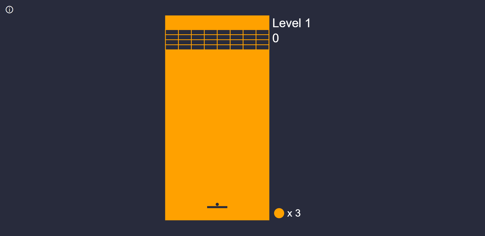

# p5-Brick-Game

Brick Game using the p5.js library

### Play it!
https://kevincrespin.github.io/p5-Brick-Game/
#### WARNING: This game is meant to be played on full screen mode on a web browser and it cannot be played on phones or tablets. Please, press F11 on your keyboard to enter full screen mode or zoom out the page until no game assets are off screen. Thank you!

### Controls

    (Move Right)        Right Arrow, D, Num Pad 6
    (Move Left)         Left Arrow, A, Num Pad 4
    (Start Game)        Space
    (Restart)           R
    (Increase level)    Press the "↑" icon located at the top-left corner
    (Decrease level)    Press the "↓" icon located at the top-left corner

### Screen Shots

## Installed Dependencies

### p5.js

[p5.js](http://p5js.org) is a Javascript library with the goal of making coding accessible for artists, designers, educators, and beginners. It is a reinterpretation of [Processing](http://processing.org), by Casey Reas and Ben Fry, initiated by artist [Lauren McCarthy](http://www.lauren-mccarthy.com/).

## Complications

* The game doesn't contain a complex set of physics which makes gameplay strightfoward, since the ball just changes x and y direction when it collides with an object.
* The bricks' collision box behaves unconstently and it may generate akward situations, especially on higher levels of the games on which the speed of the ball can be 2.3 times faster than the first level. 
* Most of the game assets positions are hard-coded, which makes screen responsiveness impossible. A fix can be implemented by using percentages instead if pixel locations, but it means that the game should be recoded entirely, but I pass.
* The game can only on full-screen, and only on full screen. If not on full screen mode, the game appears to be off-screen.
